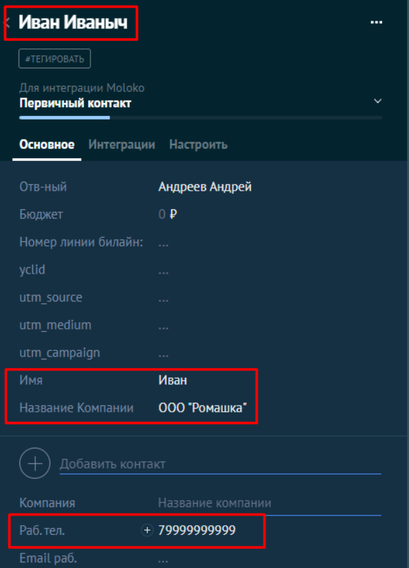

# amocrm-data-integration

Решение для тестового задания.

## Описание задачи

Требуется исходя из известных данных в файле `data.php` (данные могут быть различной структуры) структурировать эти данные и отправить их в AmoCRM, обеспечив наличие контакта в сделке.

Для взаимодействия с AmoCRM можно использовать тестовый период, который предоставляется при регистрации нового аккаунта. Это позволит вам протестировать API и платформу.

Пример входных данных:
```json
{
  "type": "call_result",
  "lead": {
    "name": "ООО Ромашка",
    "lead_phones": [],
    "phones": "+79999999999"
  },
  "contact": {
    "name": "Иван Иваныч",
    "lead_phones": [
      "+7 (999) 999-99-99"
    ],
    "phones": "+79999999999"
  },
  "call": {
  },
  "call_result": {
  }
}
```

Пример конечных данных, отправляемых в AmoCRM:

```json
{
  "name": "Иван Иваныч",
  "custom_fields_values": [
    {
      "field_code": "NAME",
      "values": [
        {
          "value": "Иван"
        }
      ]
    },
    {
      "field_code": "COMPANY_NAME",
      "values": [
        {
          "value": "ООО \"Ромашка\""
        }
      ]
    }
  ],
  "_embedded": {
    "contacts": [
      {
        "custom_fields_values": [
          {
            "field_code": "PHONE",
            "values": [
              {
                "value": "+79999999999",
                "enum_code": "WORK"
              }
            ]
          }
        ]
      }
    ]
  }
}
```

Результат отправки данных в AmoCRM:



## Перед запуском

### Создание локальной копии проекта
Скопируйте проект локально на ваш компьютер, это можно сделать средствами `git` или просто скачать архив `.zip`.
Вот пример того, как можно склонировать проект через `git` в интерфейсе командной оболочки `bash`:
```shell
git clone https://github.com/fluffur/amocrm-data-integration.git
```

### Настройка файла конфигурации `.env`
Создайте файл `.env` в корневой директории на основе `.env.example`:

```dotenv
# поддомен amoCRM
AMOCRM_SUBDOMAIN=
# долгосрочный токен, который можно получить из интеграции в amoCRM
ACCESS_TOKEN=
```


### Установка Docker Desktop
Для запуска проекта потребуется `docker`, подробные инструкции по установке можно найти [здесь](https://docs.docker.com/desktop/install/mac-install/).

## Запуск проекта

Для запуска проекта, откройте интерфейс командной строки, перейдите на корневую директорию проекта и запустите проект командой:
```shell
docker compose up -d --build
```

## Остановка проекта
Остановать проект можно этой командой:
```shell
docker compose down
```